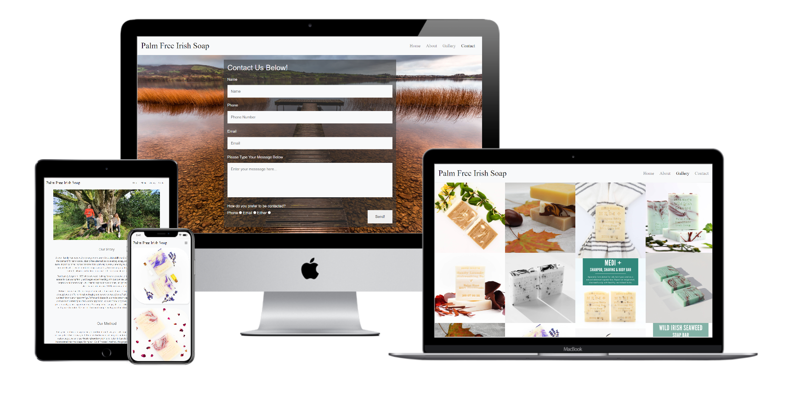
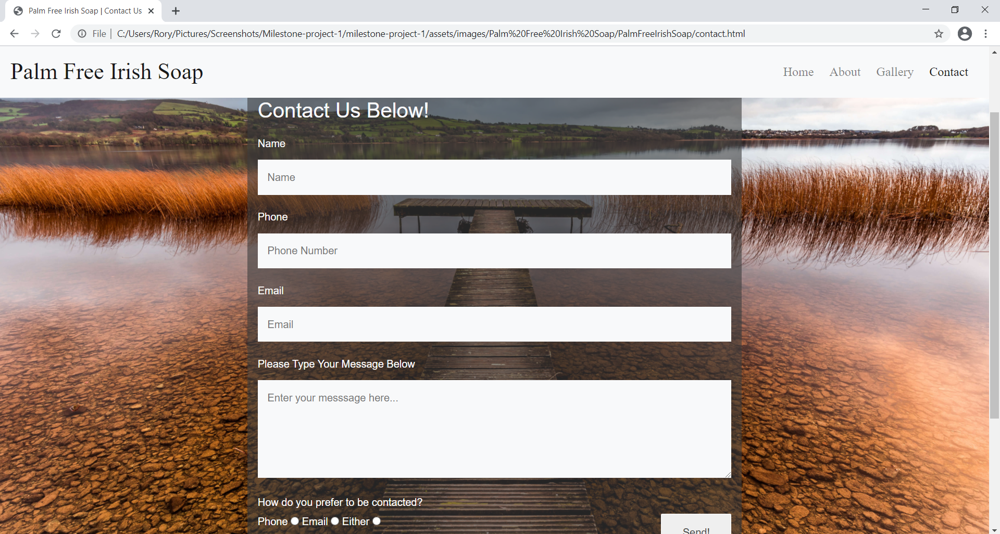
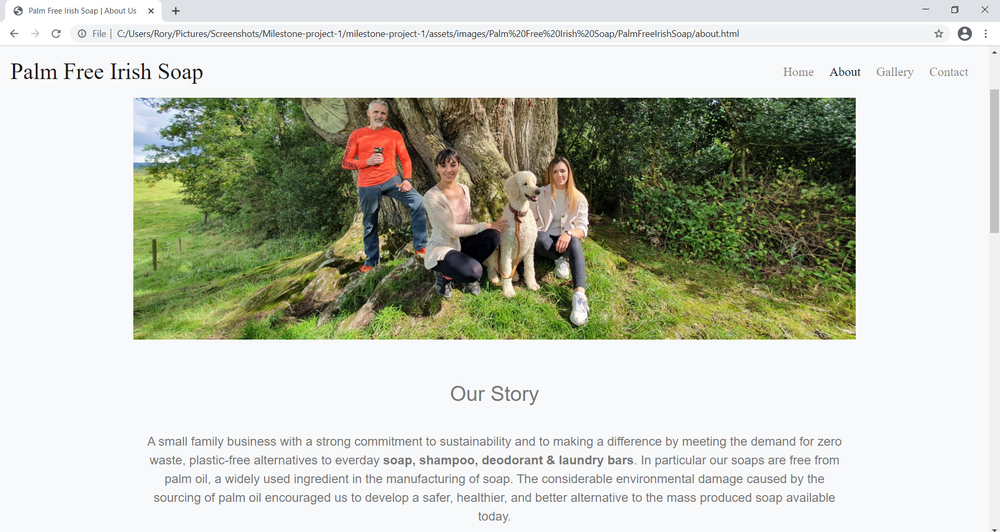
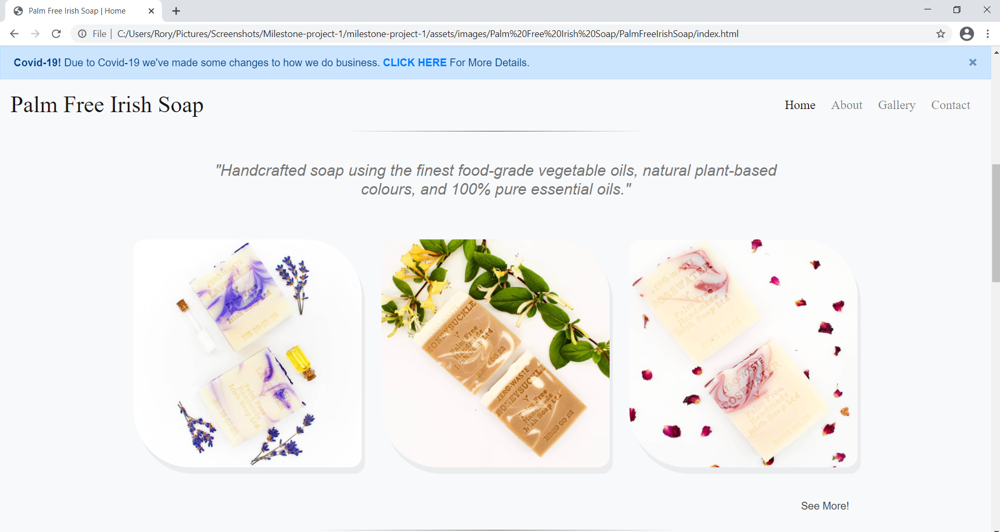

Palm Free Irish Soap

**Milestone Project One:  User-Centric Frontend Development - Code Institute**

This website is for **Palm Free Irish Soap**, a small, but growing, family-run business that focuses on a chemical-free, environmentally conscious form of soap using all-natural, vegan-friendly ingredients. The website has four pages: **Home**, **About Us**, **Gallery**, and a **Contact** page.  The website will serve as a profile for the business, it's philosophy and their products, with the ability to purchase items in future.

-  The goals of this website are to:
  - Introduce the visitor to their business, their business philosophy, and their products.
  - Display their products in a clear and obvious way through the use of high quality images, with as little clutter as possible for the visitor to deal with.
  - Act as a means of building brand awareness as a traditional small business operating in the modern world.
  - Introduce potential customers to our products through an array of visually appealing imagery while highlighting our unique selling points laid out in our About page.
  - Provide a means communication for potential customers and clients via a contact page, and through links to our social media pages.
  - Most people use their phones for online purchases nowadays so the site needs to have a mobile-first outlook, however the desktop website will display the content in an equally intuitive fashion.

## UX

### User Stories

###### User 1 : Potential Customer

- As a potential customer I am looking for products that highlight their environmentally conscious efforts in the manufacturing of their products, and reassure me of my ethical concerns.

- I prefer small, family-owned businesses as it illustrates a less corporate and more honest approach.

- I would like to see a simple layout that allows me to navigate through the website easily.

- I want to be able to easily contact the business in order to put forward any questions I may have about the product or their business.

  

- What, if any, other online presence do they have so that I may keep up to date on their products. 

###### User 2: Potential Client

- As a potential client I'm looking to know whether this company aligns with my own business model of environmentally conscious products and whether it will appeal to my own customer base and sell frequently.

  

- I would like to see a professional and stylish website that shows as much care as their products. 

- I need to easily find their contact information and how best to contact them in regards to developing a business relationship.

- What, if any, is its online presence so that I may keep up to date on their products and their business in general.

###### User 3: Curious Visitor

- As a curious visitor to the site I would like to arrive at their home page and know immediately what it is that they make, be encouraged to discover more about their business and find out what makes them different from other similar companies.

  

- I would like to see a visually striking website that grabs my interest and makes it easy to navigate from page to page.

- What I do **not** want to see is a lot of clutter that overwhelms me when I arrive at the Home page confusing me as to where to go next on their site. 

### Strategy

My main goal was to create a website with a minimalistic layout in order to highlight the products through the use of images of the products. I wanted to keep a simple colour scheme throughout with the intention of using the bright colours of the products themselves as the means of attracting the attention of the visitor.

### Scope

I wanted the website to provide a visually appealing structure so that potential customers and clients alike would be able to view the products available, see what the company is about, and make contact easily through the contact form.

### Structure/Features

All pages contain a responsive navbar and footer which allows for easy navigation throughout the site as well as externally with direct links to their various social media sites. The navbar will remain fixed to allow for easy navigation between pages. When in mobile view the navbar page links will revert into a collapsible icon with an additional collapsible card containing the contact details from the footer. The footer will contain only the social media links while in the mobile view.

The Home page will provide a preview of the products in one section with links to the Gallery page, and the same with the About Us section. 

The About Us page would provide a simple introduction into the story of their company and the methods used in the manufacturing of the product. The page will also contain a YouTube video of an interview with the business owner regarding related content.

The Gallery provides a grid layout of all the products on offer with each image able to be viewed through a modal whereby the user may transition through all other images.

The Contact page provides a simple contact form for the visitor to in order to make contact with the company for any questions they may have. 

### Features to Implement in Future

The main feature to implement in the future is the ability to purchase the products. This will include a dedicated products page displaying each item accompanied by the item description and price. A shopping cart to hold the items as the customer continues to browse which would then link to a page to complete the purchase. 

I would like to add a customer account facility where the customer can sign in, view their orders and past purchases, store their card details and delivery address, and attribute points attained through each purchase which would eventually amount to a certain discount. This would all make the customers UX much more streamlined as well as encouraging consistent purchases.

I would like to add a section in the home page where the company's Instagram account's most recent post is rendered on the page as well as highlighting any active competitions hosted through Instagram or Facebook. 

For the 'Our Method' section of the About page I would like to have an associated progress bar with images, gifs or short videos in order to give a clear visual representation of the development of the product as it goes through each stage, from beginning to end. 

A small FAQ section in the About page would also possibly be an added feature.

An option to choose the language displayed in the website would be useful as the business hopes to expand into the European market.

### Skeleton

###### Wireframes

- [Desktop Wireframe](https://github.com/RScanlon2021/milestone-project-1/tree/master/wireframes/MS1%20Desktop%20Wireframe)
- [Mobile Wireframe](https://github.com/RScanlon2021/milestone-project-1/tree/master/wireframes/MS1%20Mobile%20Wireframe)
## Technologies Used

- The developer used **VS Code** as the IDE during the development of this site.
- **Balsamiq Wireframes** was used to create the wireframes for both the desktop design and the mobile design.
- **Typora** was used to write up this README.md file
- The languages used include:
  - **HTML** 
  - **CSS**
  - **Bootstrap (4.6.0)**
- **Google fonts** as well as **FontAwesome** provided the fonts on the page as well as the icons in the footer.
- **YouTube** as the host for the interview video
- **AutoPrefixer** 
  - a VS Code extension used to make sure all CSS code is valid for all browsers.
- **[BrowserStack](https://live.browserstack.com/dashboard#os=android&os_version=10.0&device=Samsung+Galaxy+S20+Ultra&device_browser=chrome&zoom_to_fit=true&full_screen=true&url=https%3A%2F%2Frscanlon2021.github.io%2FPalmFreeIrishSoap%2Fgallery.html%23carouselExampleControls&speed=1)**. An online browser and mobile device emulator. Used to view the website and test its functionality on various browsers on multiple device sizes. 
- All images used in this site were obtained from the **Digital Marketing Associate of the Palm Free (Zero Waste) Irish Soap Ltd** with their express permission.

### Resources

- The main resources for this project were:
  - https://getbootstrap.com/
  - https://www.w3schools.com/
  - https://css-tricks.com/
  - **Code Institute** HTML/CSS module videos
  - Code Institute's Slack community for general advice.

### Testing

- [W3C CSS Validation](https://jigsaw.w3.org/css-validator/)

- [W3C Markup Validation](https://validator.w3.org/#validate_by_upload) 

  - All validations returned as "**No errors or warnings to show**"

- The three user stories, *Potential Customer*, *Potential Client*, and *Curious Visitor*, helped structure the desired outcome. From first coming to the site, regardless of the page, they are met with a highly legible navbar with **Palm Free Irish Soap** clearly displayed. Without scrolling down they can navigate throughout the site and know in advance what you are expected to encounter; a Home page, an About page, a Gallery page, and a Contact page. If they are visiting in mobile view they will also have immediate access to the business contact details through a collapsible card within the navbar. At the footer then they will easily find the business contact details as well as icon links to the business' social media profiles, each opening on to a new tab.

  As they scroll down the Home page they will encounter a row of just a few of their products, and below that then they will see a preview of the business' About Us page accompanied by images. This will encourage the visitors to explore more depending on what their priorities are.

  The About Us page has a simple layout of a central image and the some text. Not overwhelming and easily readable. At the bottom then is an embedded YouTube video with controls containing an interview pertaining to the information written in the above text.

  The Gallery page is a responsive grid layout of all their products. If an image is clicked on it opens up a controllable modal whereby they can view each image and transition between each as they see fit.

  The contact form on the Contact page requires certain input on each input field. Name, message, and radio inputs are required, and if an invalid email is entered a small warning will pop up informing the visitor of the issue.

- I tested the site on multiple browsers, including Chrome, Edge, Mozilla, and Opera, and also my own mobile devices on Chrome and Samsung Internet.

  - A few small issues did appear on my Samsung S10. The top images on the Gallery page were partially hidden underneath the header. This was rectified through a combination of adjusting the padding on the body, and reducing the font-size of the brand name and the hamburger icon.

- The site was also tested using [BrowserStack](https://live.browserstack.com/dashboard#os=android&os_version=10.0&device=Samsung+Galaxy+S20+Ultra&device_browser=chrome&zoom_to_fit=true&full_screen=true&url=https%3A%2F%2Frscanlon2021.github.io%2FPalmFreeIrishSoap%2Fgallery.html%23carouselExampleControls&speed=1). An online browser and mobile device emulator. I viewed the website and tested its functionality on various browsers on multiple device sizes. 

  - Some tablet devices with unusual screen dimensions caused a blank space to appear underneath the footer. I was able to fix this for the main brands of tablet (iPad Pro) by increasing the height of the background image container on screens with larger than usual heights.

- I have also changed the dimensions of my screen on each of the pages and tested for each way in which the pages responsivity adjusts itself and have yet to encounter any bug apart from the small issue listed as no.5 on the Project Barriers and Solutions section of this README.md file.

### Project Barriers and Solutions

1. The first significant bug I encountered was where the Hero image of index.html would not fill the whole viewport width, and when it did it only showed part of the full image.
   - My solution to this was to use background-size: cover;
2. The image in the 'Our Method' portion of the About Us section rendered as an ellipse when a circle was desired.
   - After multiple attempts at rectifying this through CSS I just resized the image file itself into a square. 
3. One issue that took me a while to figure out was when I styled bits of text as italic it didn't appear as such except for some of the time.
   - I realised that the text that did style correctly was a different font from the one that didn't. It seems the font I had chosen (Exo) did not allow for italics, so I simply changed my secondary font.
4. For my ''+ Our Details' collapsible button in the mobile navbar the presence of the nested button caused a horizontal scroll bar to appear across the site. 
   - This was fixed through the use of overflow: hidden; applied to the details-collapse-container.
5. After deploying the website I noticed that the **Contact** page did not reach the full height of the browser on **iPad Pros**. 
   - I was able to fix this for this by increasing the height of the background image container on screens with larger than usual heights.
6. One issue I haven't solved is when viewing the home page on medium to small devices a thin white line appears between the hero image and the products section. Although barely noticeable it still requires  a solution.

### Version Control

- **Git** and **GitHub**

### Deployment

To deploy this page to **GitHub Pages** from its **GitHub** repository, the following steps were taken:

1. Log into **GitHub**.
2. From the list of repositories on the screen, select [**PalmFreeIrishSoap**](https://github.com/RScanlon2021/PalmFreeIrishSoap.git)
3. At the menu above the repository, select **Settings**.
4. Scroll down to the **GitHub Pages** section.
5. Under **Source** click the drop-down menu labelled **None** and select **Master Branch**
6. Another drop-down menu will appear alongside a save button. Click **Save** which will then refresh the page.
7. Return to the repository and on the right-hand side of the page, underneath **Environments** select **github-pages**.
8. Select **View Deployment**.
9. Your deployed website will appear, copy the URL.
10. Return to the repository and on the right-hand side again select the **Settings** icon and paste the URL into the **Website** input bar, and select **Save Changes**. 
11. Your site is now live on **GitHub Pages** and able to access easily from the repository page.

#### How to run this project on an online IDE

1. You must first create a **Gitpod** account [here](https://www.gitpod.io/).
2. The you must install the **Gitpod extension** onto your browser [here](https://www.gitpod.io/docs/browser-extension/).
3. Log in to your **GitHub** account and go to the [PalmFreeIrishSoap](https://github.com/RScanlon2021/PalmFreeIrishSoap) repository. 
4. Click on the green **Gitpod** button above the project file list to clone the repository.

#### How to run this project on VS Code

1. Install **VS Code** onto your computer [here.](https://code.visualstudio.com/)
2. Upon being greeted by the *Welcome* tab click on **clone repository**.
3. Enter the following link into the input bar https://github.com/RScanlon2021/PalmFreeIrishSoap.
4. On the left hand side of the editor click on the **Run and Debug** icon and press the **Run and Debug** button.
5. Select your desired browser from the dropdown and it will then open in a new window.

### Credits

###### Primary

1. All images used in this site were obtained from the Digital Marketing Associate of the Palm Free (Zero Waste) Irish Soap Ltd with their express permission. 
2. One image (the lake image) was also obtained through Palm Free (Zero Waste) Irish Soap Ltd but is originally sourced from Shutterstock.com.
3. The name, Palm Free Irish Soap and any text taken from their original website was taken and altered with the express permission of the business.
4. The YouTube interview video was sourced from 'The Rainbow Warrior World' YouTube channel.

###### Acknowledgements 

- I took inspiration from the following sites in terms of style:
  - https://nakashimawoodworkers.com/
  - https://www.etq-amsterdam.com/
- I would like to thank Palm Free Irish Soap, their owners and their staff for giving me their permission for the development of this website.
- I would like to thank my mentor, Brian Macharia, for his help in guiding me throughout this project. 
- I would like to thank Code Institute itself, all their tutors, and my fellow enrollees for any and all assistance they may have given. 